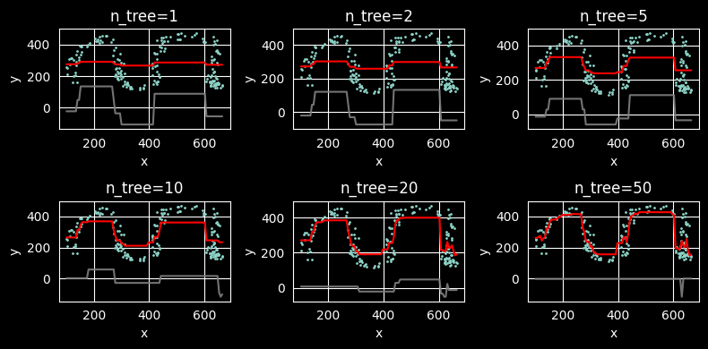
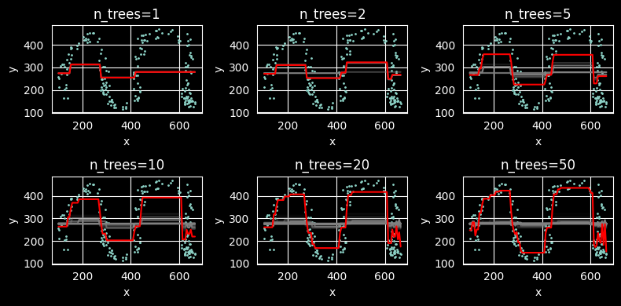

# 🧠 Ensemble Learning with scikit-learn

This repository contains **practical experiments with ensemble learning methods** implemented as part of my **Data
Science course**.  
The focus is on understanding how different ensemble techniques improve model performance, stability, and generalization
when compared to single estimators.

The project evolves over time and includes experiments with **both regression and classification ensembles**.

---

## 📂 Covered Methods

- ✅ **Synthetic Data Generation**
    - Regression data generated using `drawdata` and `ScatterWidget`
    - Visual exploration of non-linear patterns and noise

- ✅ **Decision Trees**
    - Single Decision Tree regression
    - Analysis of underfitting and overfitting behavior

- ✅ **Random Forest**
    - Comparison between a single tree and an ensemble of trees
    - Variance reduction through averaging multiple estimators

- ✅ **Bagging & Pasting**
    - Regression
    - Classification
    - Hyperparameter tuning with GridSearchCV

- ✅ **Boosting**
    - AdaBoost (conceptual introduction)
    - Gradient Boosting for regression

- ✅ **XGBoost**
    - XGBRegressor for non-linear regression
    - XGBClassifier for binary classification
    - Evaluation using Accuracy and F1-score

- ✅ **Random Forest Regression**
    - `RandomForestRegressor` for non-linear regression tasks
    - Comparison with single `DecisionTreeRegressor`
    - Reduction of variance through averaging multiple trees
    - Analysis of overfitting control via:
        - `max_depth`
        - `min_samples_leaf`
        - `n_estimators`
    - Feature importance analysis

- ✅ **Stacking (Stacked Generalization)**
    - `StackingClassifier` for classification
    - Combination of multiple base models (e.g. Logistic Regression, Random Forest, Gradient Boosting)
    - Meta-model learning from base learners' predictions
    - Cross-validation based out-of-fold predictions
    - Performance comparison with individual models
    - Evaluation using Accuracy and F1-score

---

## 🏗️ Model Architecture

```mermaid
graph TD
    VC["VotingClassifier
---
voting: hard
weights: None"]

LR["LogisticRegression
solver: liblinear
C: 1.0
max_iter: 100"]

SVC["SVC
kernel: rbf
C: 1.0
gamma: scale"]

GNB["GaussianNB
var_smoothing: 1e-09"]

VC --> LR
VC --> SVC
VC --> GNB
````

---

## 📊 Classification Report (VotingClassifier)

```bash
              precision    recall  f1-score   support

           0       0.88      0.90      0.89        71
           1       0.70      0.64      0.67        25

    accuracy                           0.83        96
   macro avg       0.79      0.77      0.78        96
weighted avg       0.83      0.83      0.83        96


```

---

## 📈 Accuracy Comparison

```bash
LogisticRegression 0.8333333333333334
SVC 0.7395833333333334
GaussianNB 0.8125
VotingClassifier 0.8333333333333334
SVC 0.7395833333333334
VotingClassifier 0.8333333333333334

```

---

## 📊 Example Results

### 🧩 Bagging & Pasting – Regression

**Best hyperparameters (GridSearchCV):**

```bash
{
  'estimator__max_depth': 12,
  'estimator__min_samples_leaf': 1,
  'estimator__min_samples_split': 2,
  'max_samples': 0.8,
  'n_estimators': 300
}

R² score: 0.9145
```

## 📊 Gradient Boosting – Regression

The figure below illustrates the effect of **Gradient Boosting Regression** on a non-linear synthetic dataset.



**Description:**

- Each subplot shows predictions for an increasing number of trees (`n_estimators`)
- With more trees, the model:
    - gradually captures complex non-linear patterns
    - reduces bias compared to a single decision tree
- The ensemble builds the final model **sequentially**, correcting errors made by previous trees

This experiment demonstrates how Gradient Boosting transitions from **underfitting to a well-generalized model** as the
ensemble grows.

## 📊 XGBoost – Regression & Classification

This section presents experiments using **XGBoost**, a high-performance and regularized implementation of gradient
boosting based on decision trees.

### 🔹 XGBoost Regressor

The plot below shows predictions generated by **XGBRegressor** on a synthetic regression dataset.



**Description:**

- The model learns complex non-linear relationships using an ensemble of shallow trees
- Compared to classical Gradient Boosting, XGBoost:
    - introduces regularization to reduce overfitting
    - uses efficient tree construction and optimized loss computation
- The regressor progressively improves predictions by correcting residual errors from previous trees


### 🔹 XGBoost Classifier

The **XGBClassifier** was trained on a binary classification task (income prediction: `>50K` vs `<=50K`).

**Results:**

```bash
Model accuracy: 0.877
Model f1 score: 0.718
```

---

## 🧪 Key Observations

- ⚖️ **Ensemble methods** often match or outperform the best single model
- 📉 **Bagging** reduces variance, especially for high-variance models
- 🧠 **Voting** benefits from model diversity
- 📌 Performance gains depend on both **model choice** and **data characteristics**
- 🚀 **XGBoost** provides strong performance with shallow trees thanks to regularization and optimized boosting
- ⚠️ Boosting-based models are more sensitive to hyperparameters and class imbalance than bagging methods

---

## 🛠️ Tech Stack

- **Python**
- **scikit-learn**
- **XGBoost**
- **NumPy / Pandas**
- **Matplotlib / Seaborn**
- **SciPy**

👤 **Piotr Lipiński** 🗓️ *Finished: February 2026* 📫 *Contributions welcome!*
